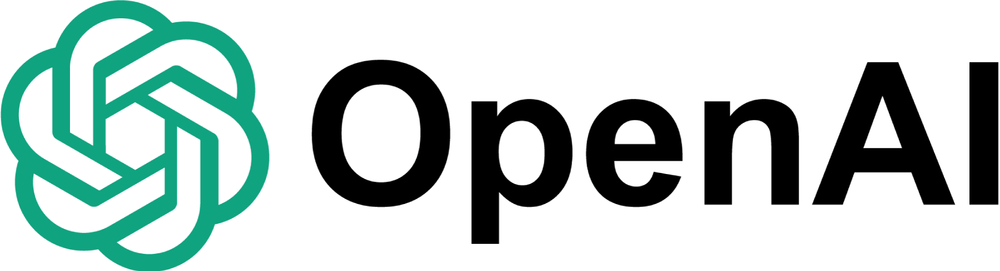
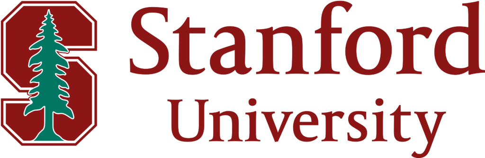

### Prospective Students

- *** To sign up for the course, please fill in this <a href="https://forms.gle/svSoNhKcGFjxup989">form</a>.***
- For course discussion and questions, please join the MOOC channel at <a href="https://discord.gg/NWVpQ9rBvd">LLM Agents Discord</a>.

## Course Staff

<table>
<tbody>
<tr>
<td>Instructor</td>
<td>Co-instructor</td>
</tr>
<tr>
<td></td>
<td></td>
</tr>
<tr>
<td><a href="https://people.eecs.berkeley.edu/~dawnsong/">Dawn Song</a></td>
<td>Xinyun Chen</td>
<tr>
<td>Professor, UC Berkeley</td>
<td>Research Scientist, Google DeepMind</td>
</tr>
</tr>
</tbody>
</table>

## Guest Speakers

<table>
<tbody>
<tr>
<td></td>
<td></td>
<td></td>
<td></td>
</tr>

<tr>
<td>Denny Zhou</td>
<td>Shunyu Yao</td>
<td>Chi Wang</td>
<td>Jerry Liu</td>
</tr>
 
<tr>
<td></td>
<td></td>
<td></td>
<td></td>
</tr>

</tbody>
</table>

<table>
<tbody>

<tr>
<td></td>
<td></td>
<td></td>
<td></td>
</tr>

<tr>
<td>Burak Gokturk</td>
<td>Omar Khattab</td>
<td>Graham Neubig</td>
<td>Nicolas Chapados</td>
</tr>
 
<tr>
<td></td>
<td></td>
<td></td>
<td></td>
</tr>

</tbody>
</table>

<table>
<tbody>

<tr>
<td></td>
<td></td>
<td></td>
<td></td>
</tr>

<tr>
<td>Yuandong Tian</td>
<td>Jim Fan</td>
<td>Percy Liang</td>
<td>Ben Mann</td>
</tr>
 
<tr>
<td></td>
<td></td>
<td></td>
<td></td>
</tr>

</tbody>
</table>

## Course Description

Large language models (LLMs) have revolutionized a wide range of domains. In particular, LLMs have been developed as agents to interact with the world and handle various tasks. With the continuous advancement of LLM techniques, LLM agents are set to be the upcoming breakthrough in AI, and they are going to transform the future of our daily life with the support of intelligent task automation and personalization. In this course, we will first discuss fundamental concepts that are essential for LLM agents, including the foundation of LLMs, essential LLM abilities required for task automation, as well as infrastructures for agent development. We will also cover representative agent applications, including code generation, robotics, web automation, medical applications, and scientific discovery. Meanwhile, we will discuss limitations and potential risks of current LLM agents, and share insights into directions for further improvement. Specifically, this course will include the following topics:
- Foundation of LLMs
- Reasoning
- Planning, tool use
- LLM agent infrastructure
- Retrieval-augmented generation
- Code generation, data science
- Multimodal agents, robotics
- Evaluation and benchmarking on agent applications
- Privacy, safety and ethics
- Human-agent interaction, personalization, alignment
- Multi-agent collaboration

## Syllabus

| Date   | Guest Lecture   (3:00PM-5:00PM PST) | Supplemental Readings | 
|--------|-------|-------|
| Sept 9 | **LLM Reasoning**   Denny Zhou, Google DeepMind   [Livestream](https://www.youtube.com/live/QL-FS_Zcmyo) <a href="https://rdi.berkeley.edu/llm-agents-mooc/slides/intro.pdf">Intro</a> <a href="https://rdi.berkeley.edu/llm-agents-mooc/slides/llm-reasoning.pdf">Slides</a> [Quiz 1](https://forms.gle/1pb6nkwZPyUqvFPe6) | - [Chain-of-Thought Reasoning Without Prompting](https://arxiv.org/abs/2402.10200)   - [Large Language Models Cannot Self-Correct Reasoning Yet](https://arxiv.org/abs/2310.01798)   - [Premise Order Matters in Reasoning with Large Language Models](https://arxiv.org/abs/2402.08939)   - [Chain-of-Thought Empowers Transformers to Solve Inherently Serial Problems](https://arxiv.org/abs/2402.12875) |   
| Sept 16 | **LLM agents: brief history and overview**   Shunyu Yao, OpenAI   [Livestream](https://www.youtube.com/watch?v=RM6ZArd2nVc) <a href="https://rdi.berkeley.edu/llm-agents-mooc/slides/llm_agent_history.pdf">Slides</a> [Quiz 2](https://forms.gle/t9ictrAjxTrWd9tr6) | - [WebShop: Towards Scalable Real-World Web Interaction with Grounded Language Agents](https://arxiv.org/abs/2207.01206)   - [ReAct: Synergizing Reasoning and Acting in Language Models](https://arxiv.org/abs/2210.03629)  |          
| Sept 23 | **Agentic AI Frameworks & AutoGen**   Chi Wang, AutoGen-AI   **Building a Multimodal Knowledge Assistant**   Jerry Liu, LlamaIndex   [Livestream](https://www.youtube.com/live/OOdtmCMSOo4) <a href="https://rdi.berkeley.edu/llm-agents-mooc/slides/autogen.pdf">Chi's Slides</a> <a href="https://rdi.berkeley.edu/llm-agents-mooc/slides/MKA.pdf">Jerry's Slides</a> [Quiz 3](https://forms.gle/osuDEXRmDHJvLi1T7) | - [AutoGen: Enabling Next-Gen LLM Applications via Multi-Agent Conversation](https://arxiv.org/abs/2308.08155)   - [StateFlow: Enhancing LLM Task-Solving through State-Driven Workflows](https://arxiv.org/abs/2403.11322)  |          
| Sept 30 | **Enterprise trends for generative AI, and key components of building successful agents/applications**   Burak Gokturk, Google | - [Google Cloud expands grounding capabilities on Vertex AI](https://cloud.google.com/blog/products/ai-machine-learning/rag-and-grounding-on-vertex-ai?e=48754805)   - [The Needle In a Haystack Test: Evaluating the performance of RAG systems](https://towardsdatascience.com/the-needle-in-a-haystack-test-a94974c1ad38)   - [The AI detective: The Needle in a Haystack test and how Gemini 1.5 Pro solves it](https://cloud.google.com/blog/products/ai-machine-learning/the-needle-in-the-haystack-test-and-how-gemini-pro-solves-it?e=48754805) |          
| Oct 7 | **Compound AI Systems & the DSPy Framework**   Omar Khattab, Databricks | - [Optimizing Instructions and Demonstrations for Multi-Stage Language Model Programs](https://arxiv.org/abs/2406.11695)   - [Fine-Tuning and Prompt Optimization: Two Great Steps that Work Better Together](https://arxiv.org/abs/2407.10930)  |          
| Oct 14 | **Agents for Software Development**   Graham Neubig, Carnegie Mellon University |  |          
| Oct 21 | **Agent for Workflow Applications**   Nicolas Chapados, ServiceNow |  |          
| Oct 28 | **Stronger Together: Marrying Neural Networks with Traditional Symbolic Decision-Making**   Yuandong Tian, Meta AI (FAIR) |  |          
| Nov 4 | **Foundation Agent**   Jim Fan, NVIDIA |  |          
| Nov 11 | **No Class - Veteran's Day** |          |          
| Nov 18 | **Cybersecurity, agents, and open-source**   Percy Liang, Stanford University |  |          
| Nov 25 | **Measuring Agent capabilities and Anthropic's RSP**   Ben Mann, Anthropic |  |   
| Dec 2 | **LLM Agent Safety**   Dawn Song, UC Berkeley |  |  

&nbsp;
## Completion Certificate

LLM Agent course completion certificates will be awarded to students based on the rules of the following tiers. All assignments are due December 12th, 2024 at 11:59PM PST.

**Trailblazer Tier:** 
- Complete all 12 quizzes associated with each lecture
- Pass the written article assignment

**Mastery Tier:**
- Complete all 12 quizzes associated with each lecture
- Pass the written article assignment
- Recieve an overall score of 75% or higher across all 3 lab assignments

**Ninja Tier:**
- Complete all 12 quizzes associated with each lecture
- Pass the written article assignment
- Submit a project to the LLM Agents Hackathon (more details coming soon!)

**Legendary Tier:**
- Complete all 12 quizzes associated with each lecture
- Pass the written article assignment
- Become a prize winner or finalist at the LLM Agents Hackathon (more details coming soon!)

**Honorary Tier:**
- For the most helpful/supportive students in discord!

_NOTE: completing the assignments associated with this course in order to earn a Completion Certificate is completely optional. You are more than welcome to just watch the lectures and audit the course!_

## Coursework

All coursework will be released and submitted through the course website.

### Quizzes

All quizzes are released in parallel with (or shortly after) the corresponding lecture. Please remember to complete the quiz each week. Although it’s graded on completion, we encourage you to do your best. The questions are all multiple-choice and there are usually at most 5 per quiz. The quizzes will be posted in the Syllabus section.

### Written Article

Create a twitter post, linkedin post, or medium article to post on Twitter of roughly 500 words. Include the link to our MOOC website in the article and tweet.

- Students in the Trailblazer or Mastery Tier should either summarize information from one of the lecture(s) or write a postmortem on their learning experience during our MOOC
- Students in the Ninja or Lengendary Tier should write about their hackathon submission

The written article is an effort-based assignment that will be graded as pass or no pass (P/NP). Submit your written article assignment [HERE](https://forms.gle/7ekobPNSWDLBWnDT6).

### Labs

There will be 3 lab assignments to give students some hands-on experience with building agents. Students must recieve an overall score of 75% or above across the 3 lab assignments. All lab assignments will be released on Oct 1st.

### Hackathon

More details coming soon!

