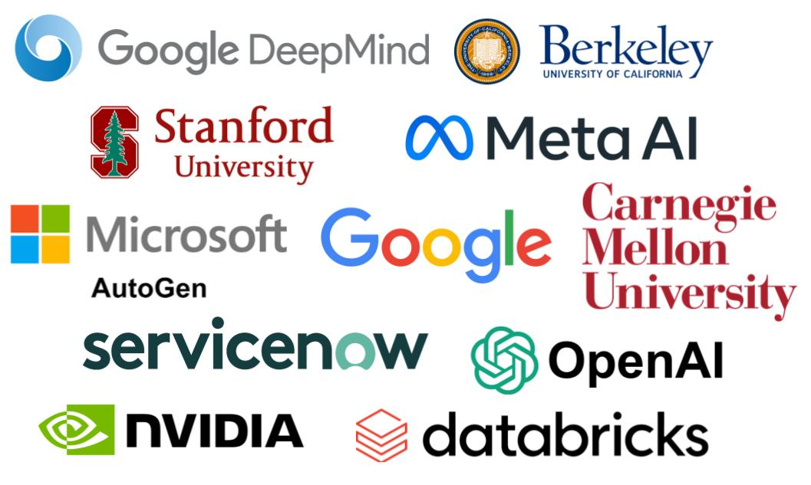

### Prospective Students

- To sign up for the course, please fill in this <a href="https://forms.gle/svSoNhKcGFjxup989">form</a>.
- For any questions, please email course staff at <a href="mailto:llmagentslearning.f24@gmail.com">llmagentslearning.f24@gmail.com</a>.

## Course Staff

<table>
<tbody>
<tr>
<td>Instructor</td>
<td>(Guest) Co-instructor</td>
</tr>
<tr>
<td></td>
<td></td>
</tr>
<tr>
<td><a href="https://people.eecs.berkeley.edu/~dawnsong/">Dawn Song</a></td>
<td>Xinyun Chen</td>
<tr>
<td>Professor, UC Berkeley</td>
<td>Research Scientist, Google DeepMind</td>
</tr>
</tr>
</tbody>
</table>

## Guest Speakers

<table>
<tbody>
<tr>
<td></td>
<td></td>
<td></td>
<td></td>
</tr>

<tr>
<td>Denny Zhou</td>
<td>Burak Gokturk</td>
<td>Chi Wang</td>
<td>Graham Neubig</td>
</tr>
 
<tr>
<td>Principal Scientist,   Google DeepMind</td>
<td>VP Engineering, Cloud AI, and   AI/ML for Developers; Google</td>
<td>Co-Founder,   AutoGen-AI</td>
<td>Associate Professor,   Carnegie Mellon University</td>
</tr>

<tr>
<td></td>
<td></td>
<td></td>
<td></td>
</tr>

<tr>
<td>Percy Liang</td>
<td>Yuandong Tian</td>
<td>Shunyu Yao</td>
<td>Nicolas Chapados</td>
</tr>
 
<tr>
<td>Associate Professor,   Stanford University</td>
<td>Research Scientist Director,   Meta AI (FAIR)</td>
<td>Research Scientist,   OpenAI</td>
<td></td>
</tr>

</tbody>
</table>

## Course Description

Large language models (LLMs) have revolutionized a wide range of domains. In particular, LLMs have been developed as agents to interact with the world and handle various tasks. With the continuous advancement of LLM techniques, LLM agents are set to be the upcoming breakthrough in AI, and they are going to transform the future of our daily life with the support of intelligent task automation and personalization. In this course, we will first discuss fundamental concepts that are essential for LLM agents, including the foundation of LLMs, essential LLM abilities required for task automation, as well as infrastructures for agent development. We will also cover representative agent applications, including code generation, robotics, web automation, medical applications, and scientific discovery. Meanwhile, we will discuss limitations and potential risks of current LLM agents, and share insights into directions for further improvement. Specifically, this course will include the following topics:
- Foundation of LLMs
- Reasoning
- Planning, tool use
- LLM agent infrastructure
- Retrieval-augmented generation
- Code generation, data science
- Multimodal agents, robotics
- Evaluation and benchmarking on agent applications
- Privacy, safety and ethics
- Human-agent interaction, personalization, alignment
- Multi-agent collaboration

## Syllabus (subject to change)

| Date   | Topic | Speaker | Readings |
|--------|-------|-------|----------|
| Sept 9 | LLM Reasoning | Denny Zhou, Google DeepMind |          |
| Sept 16 | LLM agents: brief history and overview | Shunyu Yao, OpenAI |          |
| Sept 23 | Introduction to Agentic AI and AutoGen | Chi Wang, AutoGen-AI |          |
| Sept 30 | Trends of Generative AI with Enterprises, Key blocks to build successful agents | Burak Gokturk, Google |          |
| Oct 7 |  | TBA |          |
| Oct 14 | Agents for Software Development | Graham Neubig, Carnegie Mellon University |          |
| Oct 21 | Stronger Together: Marrying Neural Networks   with Traditional Symbolic Decision-Making | Yuandong Tian, Meta AI (FAIR) |          |
| Oct 28 | LLM Agent Safety | Dawn Song, UC Berkeley |          |
| Nov 4 |  | TBA |          |
| Nov 11 | No Class - Veteran's Day |          |          |
| Nov 18 | Cybersecurity, agents, and open-source | Percy Liang, Stanford University |          |
| Nov 25 |  | Nicolas Chapados, ServiceNow |          |
| Dec 2 | Project Presentation |          |          |

## Affiliations

