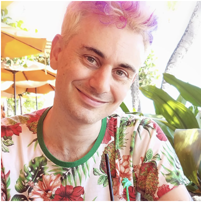

    
Announcement:

    
Sign up and learn more about the AgentX Competition <a href="https://rdi.berkeley.edu/agentx/" style="color: #4CAF50; font-weight: bold;">here</a>!

### Prospective Students

- *** To sign up for the course, please fill in this <a href="https://forms.gle/9u6HdVCWXgws16go9">form</a>.***
- For course discussion and questions, please join our <a href="https://discord.gg/NWVpQ9rBvd">LLM Agents Discord</a>.
- This course is built upon the fundamentals from the [Fall 2024 LLM Agents MOOC](https://llmagents-learning.org/f24).

## Course Staff

<table>
<tbody>
<tr>
<td>Instructor</td>
<td>(Guest) Co-instructor</td>
<td>(Guest) Co-instructor</td>
</tr>
<tr>
<td></td>
<td></td>
<td></td>
</tr>
<tr>
<td><a href="https://people.eecs.berkeley.edu/~dawnsong/">Dawn Song</a></td>
<td>Xinyun Chen</td>
<td>Kaiyu Yang</td>
<tr>
<td>Professor, UC Berkeley</td>
<td>Research Scientist,   Google DeepMind</td>
<td>Research Scientist,   Meta FAIR</td>
</tr>
</tr>
</tbody>
</table>

## Guest Speakers

<table class="table">
<tr>
<td></td>
<td></td>
<td></td>
</tr>

<tr>
<td>Jason Weston</td>
<td>Yu Su</td>
<td>Hanna Hajishirzi</td>
</tr>
 
<tr>
<td></td>
<td></td>
<td></td>
</tr>

<tr>
<td></td>
<td></td>
<td></td>
</tr>

<tr>
<td>Charles Sutton</td>
<td>Ruslan Salakhutdinov</td>
<td>Caiming Xiong</td>
</tr>
 
<tr>
<td></td>
<td></td>
<td></td>
</tr>

<tr>
<td></td>
<td></td>
<td></td>
</tr>

<tr>
<td>Thomas Hubert</td>
<td>Sean Welleck</td>
<td>Swarat Chaudhuri</td>
</tr>
 
<tr>
<td></td>
<td></td>
<td></td>
</tr>

</table>

## Course Description

Large language model (LLM) agents have been an important frontier in AI, however, they still fall short critical skills, such as complex reasoning and planning, for solving hard problems and enabling end-to-end applications in real-world scenarios. Building on our [previous course](https://llmagents-learning.org/f24), this course dives deeper into advanced topics in LLM agents, focusing on reasoning, AI for mathematics, code generation, and program verification. We begin by introducing advanced inference and post-training techniques for building LLM agents that can search and plan. Then, we focus on two application domains: mathematics and programming. We study how LLMs can be used to prove mathematical theorems, as well as generate and reason about computer programs. Specifically, we will cover the following topics:
- Inference-time techniques for reasoning
- Post-training methods for reasoning
- Search and planning
- Agentic workflow, tool use, and functional calling
- LLMs for code generation and verification
- LLMs for mathematics: data curation, continual pretraining, and finetuning
- LLM agents for theorem proving and autoformalization

## Syllabus

| Date   | Guest Lecture   (4:00PM-6:00PM PT) | Supplemental Readings | 
|--------|-------|-------|
| Jan 27th | **Inference-Time Techniques for LLM Reasoning**   Xinyun Chen, Google DeepMind   [Livestream](https://www.youtube.com/live/g0Dwtf3BH-0) <a href="https://rdi.berkeley.edu/llm-agents-mooc/slides/llm-agents-berkeley-intro-sp25.pdf">Intro</a> <a href="https://rdi.berkeley.edu/llm-agents-mooc/slides/inference_time_techniques_lecture_sp25.pdf">Slides</a> [Quiz 1](https://forms.gle/c6Zz5kGPUzkNTQiq9)  | - [Large Language Models as Optimizers](https://arxiv.org/abs/2309.03409)   - [Large Language Models Cannot Self-Correct Reasoning Yet](https://arxiv.org/abs/2310.01798)   - [Teaching Large Language Models to Self-Debug](https://arxiv.org/abs/2304.05128) |   
| Feb 3rd | **Learning to reason with LLMs**   Jason Weston, Meta   [Livestream](https://www.youtube.com/live/_MNlLhU33H0) <a href="https://rdi.berkeley.edu/llm-agents-mooc/slides/Jason-Weston-Reasoning-Alignment-Berkeley-Talk.pdf">Slides</a> [Quiz 2](https://forms.gle/BSmjwfzAtq5hP4GQ8) | - [Direct Preference Optimization: Your Language Model is Secretly a Reward Model](https://arxiv.org/abs/2305.18290)   - [Iterative Reasoning Preference Optimization](https://arxiv.org/abs/2404.19733)   - [Chain-of-Verification Reduces Hallucination in Large Language Models](https://arxiv.org/abs/2309.11495) |   
| Feb 10th | **On Reasoning, Memory, and Planning of Language Agents**   Yu Su, Ohio State University   [Livestream](https://www.youtube.com/live/zvI4UN2_i-w) <a href="https://rdi.berkeley.edu/llm-agents-mooc/slides/language_agents_YuSu_Berkeley.pdf">Slides</a> [Quiz 3](https://forms.gle/D6QogFcZ7xMNFzvo9) | - [Grokked Transformers are Implicit Reasoners: A Mechanistic Journey to the Edge of Generalization](https://arxiv.org/abs/2405.15071)   - [HippoRAG: Neurobiologically Inspired Long-Term Memory for Large Language Models](https://arxiv.org/abs/2405.14831)   - [Is Your LLM Secretly a World Model of the Internet? Model-Based Planning for Web Agents](https://arxiv.org/abs/2411.06559) |   
| Feb 17th | *No Class - Presidents' Day*  | |   
| Feb 24th | **Open Training Recipes for Reasoning in Language Models**   Hanna Hajishirzi, University of Washington   [Livestream](https://www.youtube.com/live/cMiu3A7YBks) <a href="https://rdi.berkeley.edu/llm-agents-mooc/slides/OLMo-Tulu-Reasoning-Hanna.pdf">Slides</a> [Quiz 4](https://forms.gle/WV9v2NkphN38pzoU8) | - [Tulu 3: Pushing Frontiers in Open Language Model Post-Training](https://arxiv.org/abs/2411.15124)   - [Unpacking DPO and PPO: Disentangling Best Practices for Learning from Preference Feedback](https://arxiv.org/abs/2406.09279)   - [OpenScholar: Synthesizing Scientific Literature with Retrieval-augmented LMs](https://arxiv.org/abs/2411.14199) |   
| Mar 3rd | **Coding Agents and AI for Vulnerability Detection**   Charles Sutton, Google DeepMind   [Livestream](https://www.youtube.com/live/JCk6qJtaCSU) <a href="https://rdi.berkeley.edu/llm-agents-mooc/slides/Code Agents and AI for Vulnerability Detection.pdf">Slides</a> [Quiz 5](https://forms.gle/ZCn8FZDas1VU6GrG7) | - [Interactive Tools Substantially Assist LM Agents in Finding Security Vulnerabilities](https://arxiv.org/abs/2409.16165)   - [From Naptime to Big Sleep: Using Large Language Models To Catch Vulnerabilities In Real-World Code](https://googleprojectzero.blogspot.com/2024/10/from-naptime-to-big-sleep.html) |   
| Mar 10th | **Multimodal Autonomous AI Agents**   Ruslan Salakhutdinov, CMU/Meta   [Livestream](https://www.youtube.com/live/RPINOYM12RU) <a href="https://rdi.berkeley.edu/llm-agents-mooc/slides/ruslan-multimodal.pdf">Slides</a> [Quiz 6](https://forms.gle/tpoXSkTZKChXr67q9) | - [Mind2Web: Towards a Generalist Agent for the Web](https://arxiv.org/abs/2306.06070)   - [WebArena: A Realistic Web Environment for Building Autonomous Agents](https://arxiv.org/abs/2307.13854)   - [VisualWebArena: Evaluating Multimodal Agents on Realistic Visual Web Tasks](https://jykoh.com/vwa)   - [Tree Search for Language Model Agents](https://jykoh.com/search-agents) |   
| Mar 17th | **Multimodal Agents – From Perception to Action**   Caiming Xiong, Salesforce AI Research   [Livestream](https://www.youtube.com/live/n__Tim8K2IY) <a href="https://rdi.berkeley.edu/llm-agents-mooc/slides/Multimodal_Agent_caiming.pdf">Slides</a> [Quiz 7](https://forms.gle/WksK2qeXsZp8iY7YA) | - [OSWORLD: Benchmarking Multimodal Agents for Open-Ended Tasks in Real Computer Environments](https://arxiv.org/pdf/2404.07972)   - [AGUVIS: Unified Pure Vision Agents For Autonomous GUI Interaction](https://arxiv.org/pdf/2412.04454) |
| Mar 24th | *No Class - Spring Recess*  | |   
| Mar 31st | **AlphaProof: when reinforcement learning meets formal mathematics**   Thomas Hubert, Google DeepMind   10am-noon PT   [Livestream](https://www.youtube.com/live/3gaEMscOMAU) <a href="https://rdi.berkeley.edu/llm-agents-mooc/slides/alphaproof.pdf">Slides</a> [Quiz 8](https://forms.gle/yzLSNHxNRgULpyoe9) | - [AI achieves silver-medal standard solving International Mathematical Olympiad problems](https://deepmind.google/discover/blog/ai-solves-imo-problems-at-silver-medal-level/)   - [Mastering Chess and Shogi by Self-Play with a General Reinforcement Learning Algorithm](https://arxiv.org/pdf/1712.01815)   - [The Future of Mathematics?](https://www.youtube.com/watch?v=Dp-mQ3HxgDE)   - [Building the Mathematical Library of the Future](https://www.quantamagazine.org/building-the-mathematical-library-of-the-future-20201001/) |   
| Apr 7th | **Language models for autoformalization and theorem proving**   Kaiyu Yang, Meta FAIR   [Livestream](https://www.youtube.com/live/cLhWEyMQ4mQ) <a href="https://rdi.berkeley.edu/llm-agents-mooc/slides/mathverification.pdf">Slides</a> [Quiz 9](https://forms.gle/oXmRWhwYN9vPp6AV7) | - [LeanDojo: Theorem Proving with Retrieval-Augmented Language Models](https://arxiv.org/abs/2306.15626)   - [Autoformalization with Large Language Models](https://arxiv.org/abs/2205.12615)   - [Autoformalizing Euclidean Geometry](https://arxiv.org/abs/2405.17216) |   
| Apr 14th | **Bridging Informal and Formal Mathematical Reasoning**   Sean Welleck, CMU   [Livestream](https://www.youtube.com/live/Gy5Nm17l9oo) <a href="https://rdi.berkeley.edu/llm-agents-mooc/slides/welleck2025_berkeley_bridging.pdf">Slides</a> [Quiz 10](https://forms.gle/jumLYzywCcG2Vy6v9) | - [Draft, Sketch, and Prove: Guiding Formal Theorem Provers with Informal Proofs](https://arxiv.org/abs/2210.12283)   - [miniCTX: Neural Theorem Proving with Long-Contexts](https://www.arxiv.org/pdf/2408.03350)   - [Lean-STaR: Learning to Interleave Thinking and Proving](https://arxiv.org/abs/2407.10040)   - [ImProver: Agent-Based Automated Proof Optimization](https://arxiv.org/abs/2410.04753) |   
| Apr 21st | **Program verification & generating verified code**   Swarat Chaudhuri, UT Austin   10am-noon PT | -[An In-Context Learning Agent for Formal Theorem-Proving](https://arxiv.org/abs/2310.04353)   - [Symbolic Regression with a Learned Concept Library](https://arxiv.org/abs/2409.09359) |   
| Apr 28th | **Agent safety & security**   Dawn Song, UC Berkeley | |   

## Completion Certificate

_All of the instructions below are also provided in this [Google Doc format](https://docs.google.com/document/d/1t4HS15dySldeElgDbtKmM3piInllq_auHtpO-SRScjo/edit?usp=sharing) for your convinience._

LLM Agent course completion certificates will be awarded to students based on the rules of the following tiers. **All assignments are due at the end of May (exact date/time TBA).** _All assignments should send a Google Forms confirmation email on successful submission._

All students will need to complete a Certificate Declaration Form by the end of May (exact date/time TBA). This form will be released in late April.

**Trailblazer Tier:**
- Complete all 12 quizzes associated with each lecture
- Pass the written article assignment

**Mastery Tier:**
- Complete all 12 quizzes associated with each lecture
- Pass the written article assignment
- Pass all lab assignments

**Ninja Tier:**
- Complete all 12 quizzes associated with each lecture
- Pass the written article assignment
- Submit a project to the [AgentX competition](https://rdi.berkeley.edu/agentx/)

**Legendary Tier:**
- Complete all 12 quizzes associated with each lecture
- Pass the written article assignment
- Become a prize winner or finalist at the [AgentX competition](https://rdi.berkeley.edu/agentx/)

**Honorary Tier:**
- For the most helpful/supportive students in discord!
- Meets coursework requirements of Ninja OR Mastery Tier

_NOTE: completing the assignments associated with this course in order to earn a Completion Certificate is completely optional. You are more than welcome to just watch the lectures and audit the course!_

## Coursework

IMPORTANT: Please use the same email address to submit all coursework, the certificate declaration form, and the initial signup form as this is how we track your progress throughout the course!

### Quizzes

All quizzes are released shortly after the corresponding lecture. Please remember to complete the quiz each week. Although it’s graded on completion, we encourage you to do your best. There are 5 multiple choice questions per quiz. 

The quizzes are posted in the Syllabus section. Answers will be shared when we release the next quiz. _Click on previous quiz links to access the "view score" button._

### Written Article

Create a social media post (X/LinkedIn/etc) of roughly 500 words. Include the link to our MOOC website in the article and tweet.
- Students in the Trailblazer or Mastery Tier should either summarize information from one of the lecture(s) or write a postmortem on their learning experience during our MOOC
- Students in the Ninja or Legendary Tier should write about their AgentX submission

The written article is an effort-based assignment that will be graded as pass or no pass (P/NP). 

| [Submission Form](https://forms.gle/399VqBP88WL1AJ4J6) |

### Labs

Our staff are still designing the lab(s). Stay tuned! We currently plan to release the labs mid/late April.
The link to submit the lab assignments will be posted here when the labs are released.

### Project

Check out our AgentX competition [website](https://rdi.berkeley.edu/agentx/). Every member of the team should sign up individually [here](https://forms.gle/iiszq2tBAFugfGqp8). There are no limits to team sizes.

Two Tracks:
- Entrepreneurship: Build agent-powered products & startups
- Research: Explore the frontiers of LLM Agents technology

Select students will be given mentorship by Berkeley postdocs/mentors on an AgentX Research Track project. Apply [here](https://forms.gle/E2D69euNBjSmYsK28). DUE March 26th at 11:59pm PDT. _NOTE: Mentorship is not required to join or succeed in AgentX._

Submissions will be due at the end of May. Please ask any questions and find potential team members in our [LLM Agents Discord](https://discord.gg/NWVpQ9rBvd). 

