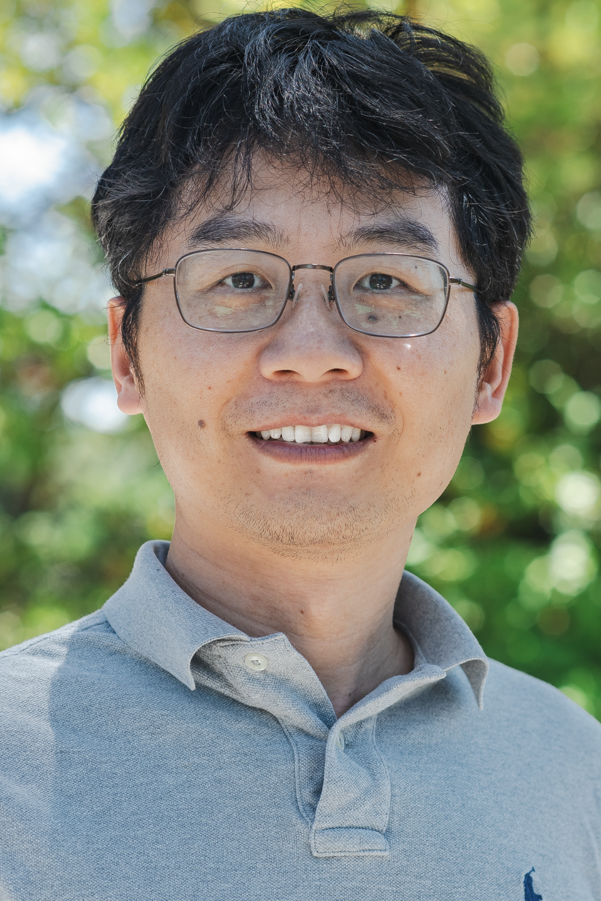
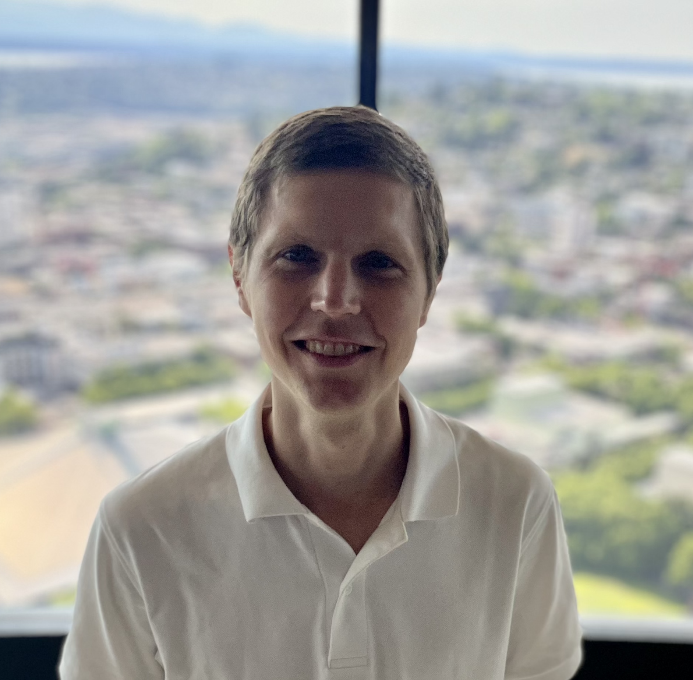

### Prospective Students

- *** To sign up for the course, please fill in this <a href="https://forms.gle/9u6HdVCWXgws16go9">form</a>.***
- For course discussion and questions, please join our <a href="https://discord.gg/NWVpQ9rBvd">LLM Agents Discord</a>.
- This course is built upon the fundamentals from the [Fall 2024 LLM Agents MOOC](https://llmagents-learning.org/f24).

## Course Staff

<table>
<tbody>
<tr>
<td>Instructor</td>
<td>(Guest) Co-instructor</td>
<td>(Guest) Co-instructor</td>
</tr>
<tr>
<td></td>
<td></td>
<td></td>
</tr>
<tr>
<td><a href="https://people.eecs.berkeley.edu/~dawnsong/">Dawn Song</a></td>
<td>Xinyun Chen</td>
<td>Kaiyu Yang</td>
<tr>
<td>Professor, UC Berkeley</td>
<td>Research Scientist,   Google DeepMind</td>
<td>Research Scientist,   Meta FAIR</td>
</tr>
</tr>
</tbody>
</table>

## Guest Speakers

<table class="table">
<tr>
<td></td>
<td></td>
<td></td>
</tr>

<tr>
<td>Jason Weston</td>
<td>Yu Su</td>
<td>Hanna Hajishirzi</td>
</tr>
 
<tr>
<td></td>
<td></td>
<td></td>
</tr>

<tr>
<td></td>
<td></td>
<td></td>
</tr>

<tr>
<td>Charles Sutton</td>
<td>Ruslan Salakhutdinov</td>
<td>Caiming Xiong</td>
</tr>
 
<tr>
<td></td>
<td></td>
<td></td>
</tr>

<tr>
<td></td>
<td></td>
<td></td>
</tr>

<tr>
<td>Thomas Hubert</td>
<td>Sean Welleck</td>
<td>Swarat Chaudhuri</td>
</tr>
 
<tr>
<td></td>
<td></td>
<td></td>
</tr>

</table>

## Course Description

Large language model (LLM) agents have been an important frontier in AI, however, they still fall short critical skills, such as complex reasoning and planning, for solving hard problems and enabling end-to-end applications in real-world scenarios. Building on our [previous course](https://llmagents-learning.org/f24), this course dives deeper into advanced topics in LLM agents, focusing on reasoning, AI for mathematics, code generation, and program verification. We begin by introducing advanced inference and post-training techniques for building LLM agents that can search and plan. Then, we focus on two application domains: mathematics and programming. We study how LLMs can be used to prove mathematical theorems, as well as generate and reason about computer programs. Specifically, we will cover the following topics:
- Inference-time techniques for reasoning
- Post-training methods for reasoning
- Search and planning
- Agentic workflow, tool use, and functional calling
- LLMs for code generation and verification
- LLMs for mathematics: data curation, continual pretraining, and finetuning
- LLM agents for theorem proving and autoformalization

## Syllabus

| Date   | Guest Lecture   (4:00PM-6:00PM PST) | Supplemental Readings | 
|--------|-------|-------|
| Jan 27th | **Inference-Time Techniques for LLM Reasoning**   Xinyun Chen, Google DeepMind   [Livestream](https://www.youtube.com/live/g0Dwtf3BH-0) <a href="https://rdi.berkeley.edu/llm-agents-mooc/slides/llm-agents-berkeley-intro-sp25.pdf">Intro</a> <a href="https://rdi.berkeley.edu/llm-agents-mooc/slides/inference_time_techniques_lecture_sp25.pdf">Slides</a> [Quiz 1](https://forms.gle/c6Zz5kGPUzkNTQiq9)  | - [Large Language Models as Optimizers](https://arxiv.org/abs/2309.03409)   - [Large Language Models Cannot Self-Correct Reasoning Yet](https://arxiv.org/abs/2310.01798)   - [Teaching Large Language Models to Self-Debug](https://arxiv.org/abs/2304.05128) |   
| Feb 3rd | **Learning to reason with LLMs**   Jason Weston, Meta   [Livestream](https://www.youtube.com/live/_MNlLhU33H0) <a href="https://rdi.berkeley.edu/llm-agents-mooc/slides/Jason-Weston-Reasoning-Alignment-Berkeley-Talk.pdf">Slides</a> [Quiz 2](https://forms.gle/BSmjwfzAtq5hP4GQ8) | - [Direct Preference Optimization: Your Language Model is Secretly a Reward Model](https://arxiv.org/abs/2305.18290)   - [Iterative Reasoning Preference Optimization](https://arxiv.org/abs/2404.19733)   - [Chain-of-Verification Reduces Hallucination in Large Language Models](https://arxiv.org/abs/2309.11495) |   
| Feb 10th | **On Reasoning, Memory, and Planning of Language Agents**   Yu Su, Ohio State University   [Livestream](https://www.youtube.com/live/zvI4UN2_i-w) | - [Grokked Transformers are Implicit Reasoners: A Mechanistic Journey to the Edge of Generalization](https://arxiv.org/abs/2405.15071)   - [HippoRAG: Neurobiologically Inspired Long-Term Memory for Large Language Models](https://arxiv.org/abs/2405.14831)   - [Is Your LLM Secretly a World Model of the Internet? Model-Based Planning for Web Agents](https://arxiv.org/abs/2411.06559) |   
| Feb 17th | *No Class - Presidents' Day*  | |   
| Feb 24th | **Reasoning and Planning in Large Language Models**   Hanna Hajishirzi, University of Washington | |   
| Mar 3rd | **Coding Agents and AI for Vulnerability Detection**   Charles Sutton, Google DeepMind | |   
| Mar 10th | **Coding agents/web agents**   Ruslan Salakhutdinov, CMU/Meta | |   
| Mar 17th | **Multimodal Agents**   Caiming Xiong, Salesforce AI Research | |   
| Mar 24th | *No Class - Spring Recess*  | |   
| Mar 31st | **AlphaProof**   Thomas Hubert, Google DeepMind | |   
| Apr 7th | **Language models for autoformalization and theorem proving**   Kaiyu Yang, Meta FAIR | |   
| Apr 14th | **Advanced Topics in Neural Theorem Proving**   Sean Welleck, CMU | |   
| Apr 21st | **Program verification & generating verified code**   Swarat Chaudhuri, UT Austin | |   
| Apr 28th | **Agent safety & security**   Dawn Song, UC Berkeley | |   

## Completion Certificate

Coming Soon!
